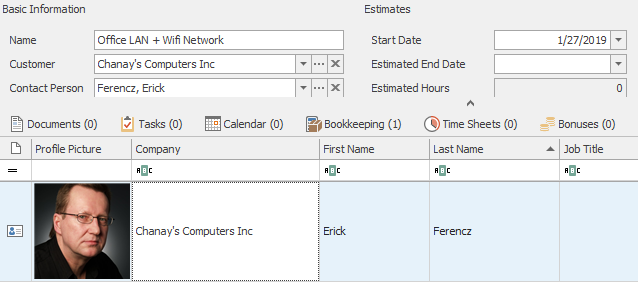
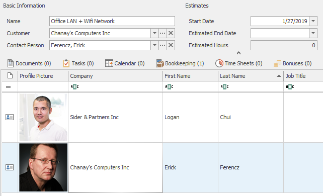

# Link to existing Item
This example shows how to create link from one existing item to another. In other words, basic relation.

First we create array of relation criteria. We need to know GUIDS of two items we want to link an their respective foldernames. The word GENERAL in relation type means, that this will be basic relation, simple link between two items. Saving itself is realized through function ```$connector->SaveRelation()``` .

```php

//Specifications of our relation
    $relation = array(
                    'ItemGUID1'     => '129641b8-3677-11e7-9e49-080027cbca76',
                    'ItemGUID2'     => 'd9705ddc-9161-44e3-82cd-0bd0063b66f5',
                    'FolderName1'   => 'Projects',
                    'FolderName2'   => 'Contacts',
                    'RelationType'  => 'GENERAL'
                    );
    
    //Save the relation
    $output = $connector->SaveRelation($relation);

```
## Output
In this example we took company with one already related contact.



After executing the code, we should see the second contact in the contacts tab on company.



### Raw output
Alternatively, you can add ```var_dump($output)``` at the end of the example code to see raw output.

## Sample code
To see the whole sample code click [here](sample_code.php)
